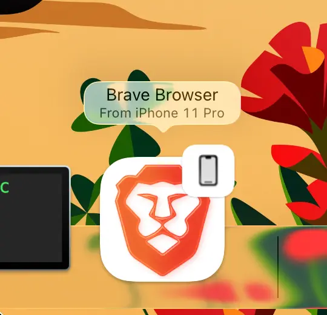
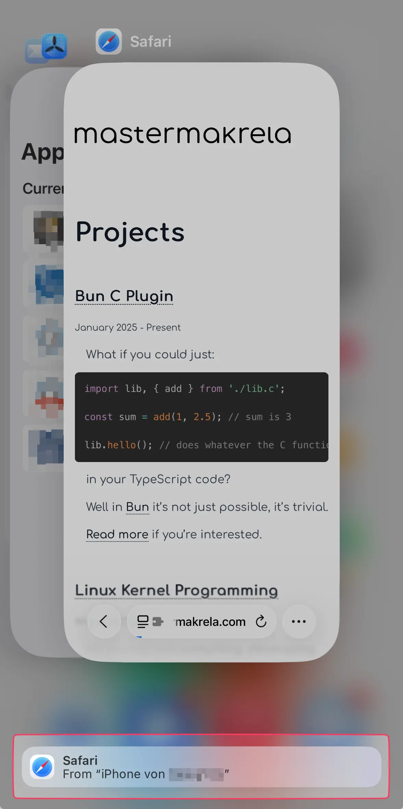

# Flutter Handoff

This plugin makes it easy to use [Apple's Handoff feature](https://support.apple.com/en-us/102426) in your Flutter applications.

Currently, it supports opening links from your application on other iCloud connected devices (Macs, iPads, iPhones).

## How to use?

After installing the plugin, you can just call the `setHandoffUrl` where appropriate
(probably after navigation to some page):

```dart
import 'package:handoff/handoff.dart';

void someFunction() async {
    await Handoff.setHandoffUrl(
        "https://example.com/some/path",
        title: "Some Title",
    );
}
```

and the system will take care of the rest.

On you connected devices, you will see the link in the Dock



or App Switcher



To hide the handoff icon, you can call `Handoff.clearHandoff()`.

## Available methods

| Method                                       | Description                                                  |
| -------------------------------------------- | ------------------------------------------------------------ |
| `setHandoffUrl(String url, {String? title})` | Sets a handoff URL using a string URL with an optional title |
| `setHandoffUri(Uri uri, {String? title})`    | Sets a handoff URL using a Uri object with an optional title |
| `clearHandoff()`                             | Clears the current handoff activity                          |
